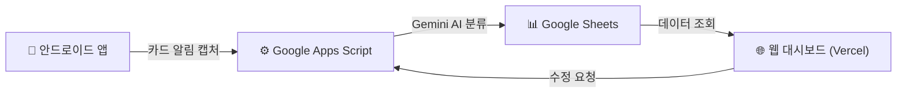

# 스마트 가계부 — 프로젝트 발전 로드맵

## 현재 시스템 구조 요약

| 구성 요소 | 역할 | 배포 방식 |
|-----------|------|-----------|
| 안드로이드 앱 (APK) | 카드사 알림을 감지하여 금액·가맹점 파싱 후 서버 전송 | 수동 설치 |
| Google Apps Script | Gemini AI로 카테고리 자동 분류, 시트 저장 | 수동 복붙 배포 |
| Google Sheets | 원본 데이터 저장소 (DB 역할) | 자동 (스크립트 연동) |
| 웹 대시보드 (PWA) | 지출 현황, 카드 실적, 분석 차트 시각화 | Vercel 자동 배포 |

---

## 🟢 단기 개선 (1~2주 내 가능, 비용 없음)

### 1. 월별 예산 설정 및 초과 경고
- 현재는 카드별 "실적 한도"만 있고, **전체 월 예산 개념이 없음**
- "이번 달 목표 지출: 150만원" 같은 예산을 설정하고, 80% 도달 시 대시보드에 경고 배너를 표시
- 프로그래스 바로 예산 대비 소비율을 한눈에 확인

### 2. 카테고리별 예산 한도
- "카페 월 5만원", "쇼핑 월 20만원"처럼 카테고리마다 상한선을 설정
- 초과 시 해당 카테고리 아이콘이 빨간색으로 변하는 등 시각적 피드백

### 3. 거래 내역 검색 및 필터
- 현재 거래 목록은 단순 나열만 가능
- **가맹점명 검색**, **카테고리 필터**, **금액 범위 필터**, **날짜 범위 필터** 추가
- "이번 달 쿠팡에서 얼마 썼지?" 같은 질문에 즉시 답변 가능

### 4. 고정 지출 자동 인식
- 매월 반복되는 결제(넷플릭스, 통신비, 보험료 등)를 자동으로 "고정 지출"로 태깅
- 대시보드에 "고정 지출 vs 변동 지출" 비율을 보여줌

### 5. 추가 카드사 파서 확장
- 현재 지원: 신한, NH농협, 현대, 하나
- 추가 필요 시: KB국민, 삼성, 롯데, 우리, BC 등
- 새로운 카드 알림이 올 때마다 원문을 공유해 주시면 즉시 파서를 추가 가능

---

## 🟡 중기 개선 (1~2개월, 약간의 학습 필요)

### 6. 월별 비교 분석 (전월 대비)
- "지난달 대비 이번 달 지출이 12% 증가했습니다" 같은 트렌드 분석
- 카테고리별로 전월 대비 증감을 화살표(↑↓)로 표시
- 최근 3~6개월 지출 추이 라인 차트 추가

### 7. 가계부 공유 (가족 모드)
- 배우자와 함께 가계부를 공유하고 싶은 경우
- Google Sheets 자체가 공유 기능을 지원하므로, 시트를 공유한 뒤 대시보드에서 "누구의 결제인지" 구분하는 태그만 추가하면 구현 가능

### 8. PWA 오프라인 모드 강화
- 현재 PWA는 인터넷이 끊기면 데이터를 볼 수 없음
- Service Worker 캐싱을 강화하여 마지막으로 불러온 데이터를 오프라인에서도 열람 가능하게 개선

### 9. 내보내기 기능 (CSV / 엑셀)
- 특정 월이나 기간의 거래 내역을 CSV 또는 엑셀 파일로 다운로드
- 연말정산, 세금 신고 등에 활용 가능

### 10. 알림/리마인더 기능
- "이번 주 벌써 외식비 10만원을 넘었습니다" 같은 푸시 알림
- 안드로이드 앱에서 주기적으로 지출 현황을 체크하여 자체 알림 발송

---

## 🔴 장기 비전 (3개월 이상, 구조적 변화)

### 11. Gemini AI 활용 고도화
- 현재: 단순 카테고리 분류
- 발전: **"이번 달 소비 패턴 분석 리포트"** 자동 생성
  - "카페 지출이 전월 대비 40% 증가했습니다. 주로 스타벅스에서 사용하셨습니다."
  - "이번 달은 마트 지출이 적었지만, 쇼핑몰 지출이 크게 늘었습니다."
- 월말에 AI가 작성한 소비 리포트를 대시보드 상단에 카드 형태로 표시

### 12. 수입 관리 통합
- 현재는 "지출"만 추적
- 급여, 부수입 등 수입도 함께 기록하여 **순자산 변동 추이**까지 관리
- "이번 달 수입 대비 저축률: 32%" 같은 지표 제공

### 13. 영수증 OCR 스캔
- 현금 결제는 카드 알림이 오지 않으므로 현재 추적 불가
- 카메라로 영수증을 찍으면 Gemini Vision API가 금액과 가맹점을 자동 인식하여 등록
- 현금 지출도 빠짐없이 관리 가능

### 14. 다중 계좌/자산 관리
- 여러 은행 계좌의 잔액을 통합 관리
- "전체 자산 현황" 대시보드: 계좌 잔고 + 카드 미결제 금액 = 순 자산

---

## 우선순위 추천

> [!TIP]
> 아래는 **투입 노력 대비 체감 효과**가 큰 순서로 추천드리는 우선순위입니다.

| 순위 | 항목 | 난이도 | 체감 효과 |
|:----:|------|:------:|:---------:|
| 1 | 거래 내역 검색/필터 | ⭐ | ⭐⭐⭐⭐⭐ |
| 2 | 월별 예산 설정 + 초과 경고 | ⭐⭐ | ⭐⭐⭐⭐⭐ |
| 3 | 월별 비교 분석 (전월 대비) | ⭐⭐ | ⭐⭐⭐⭐ |
| 4 | 카테고리별 예산 한도 | ⭐⭐ | ⭐⭐⭐⭐ |
| 5 | 고정 지출 자동 인식 | ⭐⭐⭐ | ⭐⭐⭐⭐ |
| 6 | AI 소비 리포트 | ⭐⭐⭐ | ⭐⭐⭐⭐⭐ |
