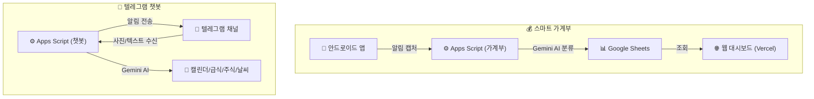
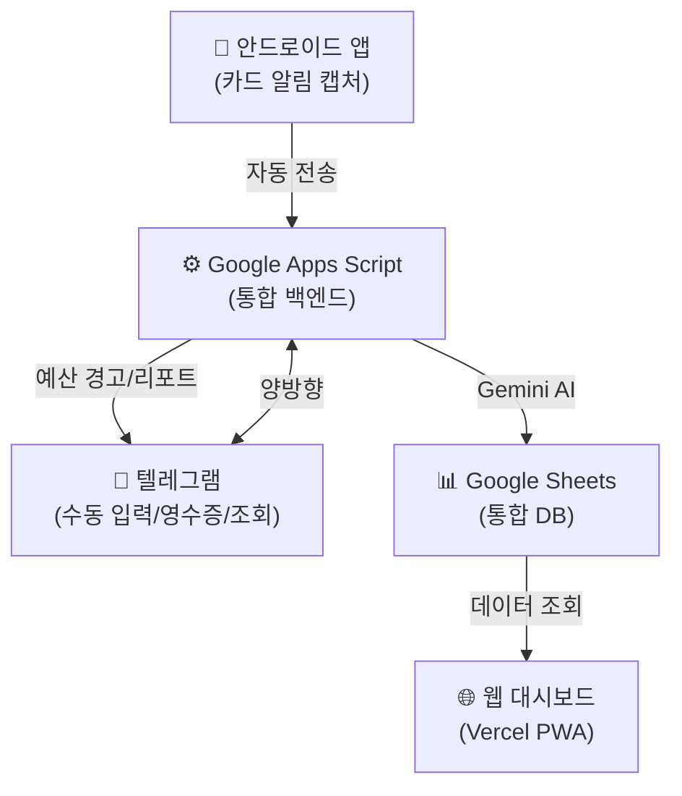

# 스마트 가계부 × 텔레그램 챗봇 — 연동 발전 방안

## 현재 두 프로젝트 구조



| | 스마트 가계부 | 텔레그램 챗봇 |
|---|---|---|
| **백엔드** | Google Apps Script | Google Apps Script |
| **AI** | Gemini (카테고리 분류) | Gemini (식단 판독, 메뉴 추천, 일정 파싱) |
| **데이터** | Google Sheets | PropertiesService + 캘린더 |
| **알림** | 없음 (PWA만) | 텔레그램 채널로 자동 발송 |

> [!IMPORTANT]
> 두 프로젝트 모두 **Google Apps Script + Gemini AI** 기반이라 통합이 매우 자연스럽습니다.
> 텔레그램 챗봇이 이미 갖고 있는 **"시간 트리거 + 메시지 발송"** 인프라를 가계부가 그대로 빌려 쓸 수 있습니다.

---

## 🟢 즉시 가능한 연동 (난이도 ⭐, 효과 극대)

### 1. 예산 초과 경고를 텔레그램으로 알림 📢
**PWA 푸시 알림 대신 텔레그램을 쓰면 별도 서버 세팅 없이 즉시 구현 가능합니다.**

- 가계부 Apps Script(`Code.gs`)에 `sendBudgetAlert()` 함수를 추가
- Google Sheets에서 이번 달 총 지출을 계산하고, 설정한 예산의 80%/100% 도달 시 텔레그램 채널로 경고 메시지 자동 발송
- 기존 텔레그램 봇의 `sendToTelegram()` 함수를 그대로 재활용
- 시간 트리거(예: 매일 21:00)로 하루 한 번 체크하거나, 결제가 들어올 때마다 즉시 체크

```
💰 [가계부 예산 알림]

⚠️ 이번 달 지출이 예산의 80%에 도달했습니다!
총 지출: ₩1,200,000 / 예산: ₩1,500,000
남은 예산: ₩300,000 (11일 남음)
```

### 2. 일일 지출 리포트를 텔레그램으로 발송 📊
- 기존 챗봇의 트리거 패턴(07:00 주식, 07:30 날씨, 08:00 급식...)에 **"21:00 오늘의 지출 요약"**을 추가
- 오늘 결제된 내역을 요약해서 가족 채널에 전송

```
💳 [오늘의 지출 요약]

오늘 총 3건, ₩45,200 사용
🛒 쿠팡 ₩32,000 (마트)
☕ 스타벅스 ₩8,700 (카페)
🍚 김밥천국 ₩4,500 (밥)

이번 달 누적: ₩892,000 / 예산 ₩1,500,000 (59%)
```

### 3. 카드 실적 달성 알림 🎯
- 특정 카드의 실적이 100%에 도달하면 텔레그램으로 즉시 축하(?) 알림
- "🎉 NH농협카드 실적 34만원 달성! 이제 혜택을 받을 수 있습니다."

---

## 🟡 약간의 작업이 필요한 연동 (난이도 ⭐⭐)

### 4. 텔레그램으로 수동 지출 입력 ✍️
- 현금 결제나 카드 알림이 안 온 경우, 텔레그램 채팅에 자연어로 입력
- 예: `"쿠팡 32000원 마트"` 또는 `"점심 김밥천국 4500"`
- 기존 챗봇의 `handleIncomingText()` 패턴을 확장하여 Gemini가 금액/가맹점/카테고리를 파싱
- 파싱된 데이터를 가계부 Google Sheets에 자동 기록

```
사용자: "점심 맥도날드 8900원"
봇: "✅ 기록 완료!
      📦 맥도날드 | ₩8,900 | 밥
      수정이 필요하면 대시보드에서 변경해주세요."
```

### 5. 텔레그램으로 지출 조회 🔍
- `"이번 달 카페 얼마 썼어?"` → 봇이 시트를 조회해서 답변
- `"쿠팡 지출 내역"` → 이번 달 쿠팡 결제 목록을 보여줌
- `"이번 달 요약"` → 카테고리별 지출 파이 차트 텍스트 버전

### 6. 월말 AI 소비 리포트를 텔레그램으로 발송 🧠
- 매월 1일 아침, Gemini AI가 지난달 전체 지출 데이터를 분석
- "지난달 카페 지출이 40% 늘었네요. 특히 주말 오후에 집중되어 있습니다." 같은 인사이트를 텔레그램으로 자동 발송

```
📊 [6월 소비 리포트 by Gemini AI]

총 지출: ₩1,423,000 (전월 대비 +8%)

📈 증가: 카페 +40%, 쇼핑 +25%
📉 감소: 마트 -15%, 여가 -30%

💡 AI 코멘트:
"6월은 카페 지출이 눈에 띄게 늘었습니다.
주말 오후 스타벅스 방문이 6회로 집중되어 있네요.
반면 마트 지출이 줄어 외식 비중이 높아진 달이었습니다."
```

---

## 🔴 고급 연동 (난이도 ⭐⭐⭐)

### 7. 영수증 사진 → 텔레그램으로 가계부 등록 📸
- 기존 챗봇이 **유치원 식단표 사진을 Gemini Vision으로 판독하는 기능**을 이미 갖고 있음
- 동일한 패턴을 활용하여 **영수증 사진**을 텔레그램에 올리면 Gemini Vision이 금액/가맹점/품목을 추출
- 추출된 데이터를 가계부 시트에 자동 저장
- 현금 결제도 놓치지 않고 기록 가능!

### 8. 가족 구성원별 지출 분리 👨‍👩‍👧
- 텔레그램 채팅방에서 메시지를 보낸 사람의 ID로 "누구의 지출인지" 자동 태깅
- 대시보드에서 "아빠 지출 / 엄마 지출" 필터로 분리 조회

---

## 통합 아키텍처 (최종 비전)



---

## 추천 우선순위

> [!TIP]
> 텔레그램 챗봇의 기존 인프라(`sendToTelegram`, 시간 트리거, Gemini 연동)를 활용하면
> **추가 서버 비용 0원**으로 아래 기능들을 구현할 수 있습니다.

| 순위 | 항목 | 난이도 | 체감 효과 | 비고 |
|:----:|------|:------:|:---------:|------|
| 1 | 예산 초과 경고 (텔레그램) | ⭐ | ⭐⭐⭐⭐⭐ | PWA 푸시 대체, 즉시 가능 |
| 2 | 일일 지출 리포트 | ⭐ | ⭐⭐⭐⭐⭐ | 기존 트리거 패턴 재활용 |
| 3 | 카드 실적 달성 알림 | ⭐ | ⭐⭐⭐⭐ | 1번과 함께 구현 |
| 4 | 텔레그램 수동 지출 입력 | ⭐⭐ | ⭐⭐⭐⭐⭐ | 현금 결제 커버 |
| 5 | 월말 AI 소비 리포트 | ⭐⭐ | ⭐⭐⭐⭐⭐ | Gemini 기존 연동 활용 |
| 6 | 영수증 사진 등록 | ⭐⭐⭐ | ⭐⭐⭐⭐ | 기존 Vision 판독 패턴 재활용 |
